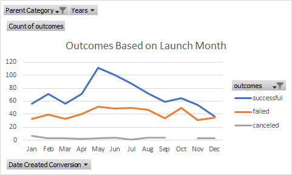
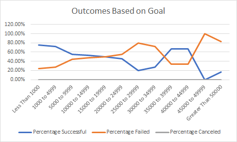

# Kickstarting with Excel

## Overview of Project
This analysis exhibits the trends seen in the outcomes of Kickstarter campaigns from 2009-2017 based on a variety of variables, including the initial launch date and goal amount of each campaign.

## Analysis and Challenges

I filtered based on the launch date of each campaign so that average number of successful, failed, and canceled campaigns could be compared for each month in the year. This was meant to determine which months and times in the year have historically been best for launching a successful campaign.

I filtered based on the goal amount of each campaign so that the average number of successful, failed, and canceled campaigns could be compared for different goal amount ranges. This method was used to determine how the initial goal amount can be set in order to increase the likelihood of a campaign being successful.

A few of the campaigns in this data set showed very high goal amounts which have skewed the average for the goal category. However, all these campaign results proved to be unsuccessful, which meant that the successful data was relatively unaffected. 

## Results

- The beginning and end of the year seem to be the worst times for launching as they exhibit the lowest number of successful campaigns in this data. The period from May-June seems to allow for the greatest percentage of successful campaigns.

- Keeping the goal amount under $15000 will increase the chances of having a successful campaign. 

- There are outliers based on goal amount due to an initial overestimation of success and a resulting lack of backers. The data set also only includes 2009-2017, which leaves out potential change of trends in the last 4 years. Similarly, not all categories currently available on Kickstarter are displayed in this data set. 

- Additional tables could display data including these missing parameters stated above. In addition, examining the influence of the category type on the number of backers could be an interesting metric to consider. 
